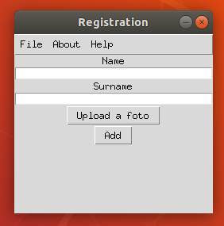

# Registration
This is a simple registration program, which is a part of a bigger problem.

## Dependencies

<ul>
  <li> csv (conda install -c anaconda csvkit) </li>
  <li> open cv (conda install -c conda-forge opencv) </li>
</ul>

**HOW TO USE**
<ul>
  <li> Use the New Event Submenu from the File menu to create an event or use the Load Event to load an event  </li>
  <li> Fill the name and the surname text field </li>
  <li> If you want you can upload a picture of yourself using Upload a foto button</li>
  <li> Use the Add button to add him to the event</li>
</ul>

**Current Version**

 

