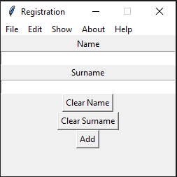

# Registration

This is a simple registration program, which is a part of a bigger problem.

[](https://www.python.org/) [](http://perso.crans.org/besson/LICENSE.html)

# Table of contents

<!--ts-->
  * [Registration](#Registration)
  * [Table of contents](#Table_of_contents)
  * [Dependencies](#Dependencies)
  * [Files](#Files)
  * [Current Version](#Current_Version)
  * [Documentation](#Documentation)
  * [Radon](#Radon)
    * [Radon_cc](#Radon_cc)
    * [Radon_hal](#Radon_hal)
    * [Radon_mi](#Radon_mi)
    * [Radon_raw](#Radon_raw)
  * [Keybinds](#Keybinds)
  * [License](#License)
<!--ts-->

## Dependencies

Install the dependencies

<ul>
  <li> csv (conda install -c anaconda csvkit) </li>
  <li> second way to install csv ( pip install python-csv) </li>
  <li> open cv (conda install -c conda-forge opencv) </li>
  <li> second way to install open cv ( pip install opencv-contrib-python-headless) </li>
</ul>

or run


```shell
pip install -r requirements.txt
```

## Files

<ul>
  <li> regi.py(the main file)</li>
  <li> Registration keybinds(keybinds file) </li>
  <li> images (images folder) </li>
  <li> doc (documentation folder) </li>
 </ul>


## Current Version

<p> </p>

## Documentation

All project documentation is located in the `./doc`  folder.

## Radon

### Radon_cc

<p> </p>

### Radon_hal

<p> </p>

### Radon_mi

<p> </p>

### Radon_raw

<p> </p>

## Keybinds

<ul>
  <li> New Event </li>
  <li> Load Event </li>
  <li> Close Event </li>
  <li> Add Member (Alt + T) </li>
  <li> Upload a foto (Alt + U) </li>
  <li> Exit(Alt+F4) </li>
  <li> Clear Name (Ctrl + N) </li>
  <li> Clear Surname (Ctrl + S) </li>
  <li> Show member (Ctrl + T) </li>
  <li> About(Ctrl+I) </li>
  <li> Help(Ctrl+F1) </li>
</ul>


## License
[GNU GPLv3](https://choosealicense.com/licenses/gpl-3.0/)
